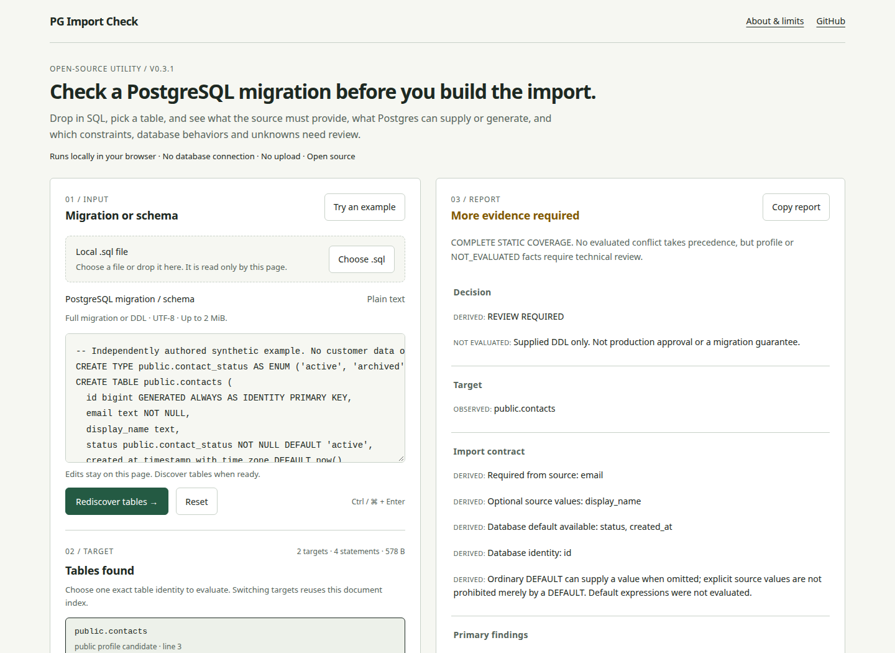
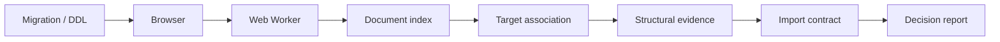

# PG Import Check

**Static import-readiness analysis for PostgreSQL migrations.**

Drop in a migration, choose a target table, and see what the source must provide,
what Postgres controls, and what still needs review.

**[Try it live](https://check.importflow.dev)** · **[Run it locally](#run-locally--self-host)** · [24-second product demo](docs/demo/walkthrough.webm)

[](https://check.importflow.dev)

Runs locally in your browser · No database connection · No upload · No signup

## What it tells you

- **Source requirements:** required and optional values, ordinary defaults, identity
  columns and database-generated expressions. A default does not prohibit a source value.
- **Structural findings:** declared uniqueness, enums, foreign keys, checks, triggers
  and policy structure, with identifiers and evidence.
- **What remains unknown:** explicit static coverage, unsupported statements,
  unresolved target association and the next technical review.

The complete Decision Report, Technical Evidence and plain-text report are free.
Nothing is gated behind an account or commercial conversation.

## A Decision Report, in context

The [synthetic demo migration](docs/demo/migration.sql) declares an identity-generated
`public.contacts.id`, required `email`, optional `display_name`, an enum-backed
`status` with a default, and `created_at DEFAULT now()`. It also declares a named
unique constraint on `email`.

The report distinguishes what the source must provide from defaults and generation,
then keeps constraint and runtime review visible. A unique declaration does not prove
that incoming values are unique or absent from the destination. A declared default
is not proof that the expression will succeed at runtime.

**Observed**, **Derived**, **Not evaluated**, and **Recommendation** are distinct
labels throughout the report. Expand **Technical Evidence** for source locations,
rule IDs and the exhaustive statement ledger. Copy the full report only when you
intend to share its schema identifiers.

## How it works

1. Paste migration/DDL or select/drop a local UTF-8 `.sql` file.
2. Discover table identities. Schema qualification is preserved; unqualified names
   are not silently assumed to be `public`.
3. Choose a target. A retained worker index supplies structural evidence, the import
   contract, Decision Report and Technical Evidence.

The analyzer is deterministic and bounded. There is no model call, SQL execution,
network analysis service or live database connection.

## Architecture



**NO DATABASE CONNECTION · NO BACKEND ANALYSIS · NO SQL EXECUTION · NO MIGRATION UPLOAD**

[Architecture and contributor code map](docs/ARCHITECTURE.md) explains the real data
flow, worker boundary, limits and separate CLI path.

## Privacy and trust boundary

SQL and reports stay in browser memory. The app does not put them in URLs,
cookies, local/session storage, analytics or error reporting. Reloading clears them.
Local files are read by the page and passed to its worker. No database credentials
are requested. No external fonts or scripts are loaded.

The host serves static files and may keep ordinary request logs. Local processing
does not mean that loading a hosted page makes no requests. Self-host for control
of that hosting boundary.

The CSP retains `connect-src 'none'`, alongside blocked images/fonts and constrained
same-origin scripts, styles and workers. Optional links send no SQL or report, and
navigation uses `no-referrer`. Review [security](docs/SECURITY.md) and the
[threat model](docs/THREAT_MODEL.md).

## Current supported boundary

v0.3.1 is a presentation release on the unchanged **v0.3.0 engine**.

Browser input is bounded to **2 MiB of UTF-8**, 20,000 statements, 150,000 tokens and
5,000 targets, with 256 associated statements per target. Supported CREATE TABLE
and associated declaration forms yield structural evidence. Unsupported mutations
and unresolved identities remain visible rather than being silently treated as covered.

The report includes a comparison against the dated **`importflow-envelope-v4`**
profile, reviewed September 9, 2026. That profile concerns ImportFlow's narrow Alpha
schema envelope. A profile conflict is **not a universal PostgreSQL error**, and a
report does not establish current pilot eligibility. The checker has no Supabase
integration and its useful static evidence stands independently of that comparison.

Exact boundaries: [migration analysis](docs/MIGRATION_ANALYZER_V02.md),
[Decision Report](docs/DECISION_REPORT_V03.md), [dated profile](docs/PUBLIC_PROFILE_V4.md).

## What it does not prove

It does not validate source rows, execute expressions, inspect live schema state,
resolve effective permissions/RLS, infer trigger side effects, choose business keys,
prove complete migration history, or guarantee that a production import is safe.
“Complete static coverage” only describes the supported supplied declarations.
Unknowns are not failures; recommendations are not observed facts.

## Run locally / self-host

Use Node **24.20.0 or later within Node 24** and npm **11.19.0**.

```sh
git clone https://github.com/iammohamedatef/pg-import-check.git
cd pg-import-check
npm ci --ignore-scripts --no-audit --no-fund
npm run build:web
npm run preview
```

Open `http://127.0.0.1:4173`. No database, credentials or backend is needed.

To deploy on a generic static host, publish the contents of **`dist/web/`** after
building. Serve the security and caching headers in [vercel.json](vercel.json): the
preview server supplies the same security boundary locally, while another host needs
its equivalent header configuration. Use HTTPS, JavaScript MIME types and same-origin
worker delivery. Revalidate HTML; cache the hashed JS/CSS assets immutably. Do not add
an analysis API or relax `connect-src 'none'`.

## CLI

```sh
npm run build
node cli/pg-import-check.mjs < schema.sql
```

The CLI retains its frozen single-target, **262,144-byte** input contract. Supply
bytes on stdin; filenames and flags are not interpreted. It does not provide browser
multi-target discovery. Exit 0 means analysis completed, **not** compatibility passed;
2 means refusal and 1 an internal error. Its legacy profile terminology is preserved.
No npm registry executable is published.

## Tests and verification

```sh
npm run verify
npm run build:web
npx playwright install chromium firefox webkit
npm run test:e2e
```

Coverage includes engine regression, deterministic evidence, malformed bytes,
hostile identifiers, worker recovery, privacy canaries, CSP and desktop/mobile browser
behavior. Verification requires no production database or third-party schema.

To reproduce the real demo, run the local preview, then:

```sh
node scripts/capture-demo.mjs
```

The capture uses only `docs/demo/migration.sql`. It records actual input, target
selection, report and evidence disclosure. The screenshot and small WebM are committed;
no customer schema or private local path appears in the product recording.

## Contributing and repository layout

Start with [the architecture code map](docs/ARCHITECTURE.md) and
[contributing guidance](docs/CONTRIBUTING.md). Browser presentation lives in `web/`;
pure analysis lives in `src/`; bounded profile material is in `spec/`; regressions
live in `test/` and `e2e/`. Preserve observed/derived/unknown/recommendation distinctions.
The plain-text report is not a stable public JSON API.

## Relationship to ImportFlow

PG Import Check is an independent open-source utility built by
[ImportFlow](https://importflow.dev). It remains useful without a commercial engagement
and can be built and deployed independently.

ImportFlow's separate [design-partner pilot](https://importflow.dev/design-partner)
provides founder-assisted preparation for a narrow one-table, insert-only Supabase
migration. Your engineer executes the production step. The optional continuation
appears after the complete checker report; neither SQL nor report is sent.

## License

[MIT](LICENSE). Redistribution also includes [NOTICE](NOTICE) and
[Unicode licensing](UNICODE-LICENSE.txt). Report security issues through the
[private security contact](docs/SECURITY.md).
