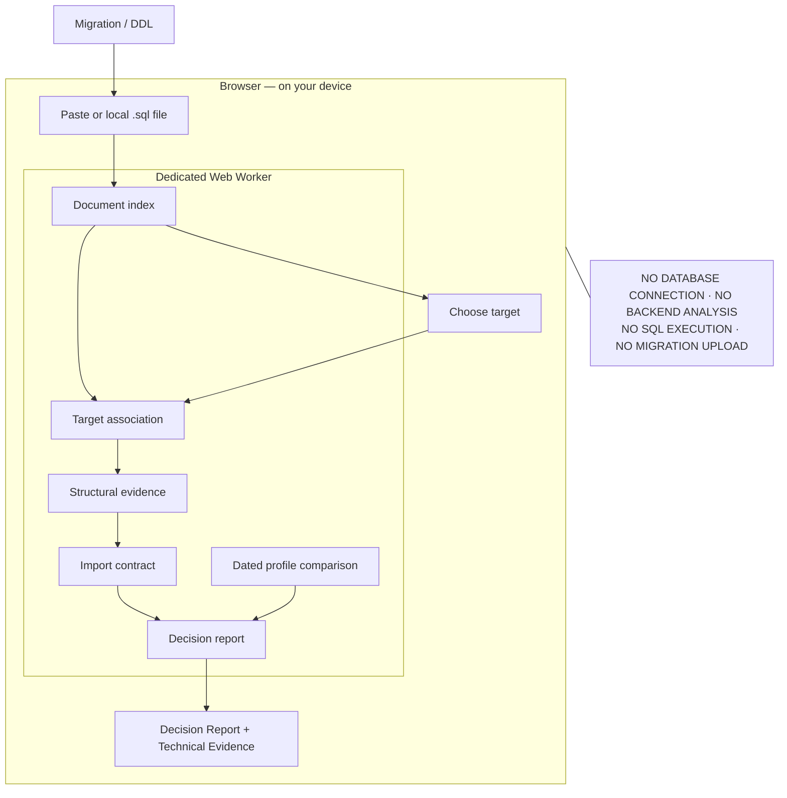

# Architecture

The hosted tool is a static application. SQL processing stays in a dedicated Web
Worker on the visitor's device. Selecting another target reuses the document index.

The diagram describes the browser path in v0.3. The v0.3.1 release changes presentation
and documentation; it does not change this engine or the dated profile.

## Code map

| Path | Responsibility |
| --- | --- |
| `web/index.html`, `web/style.css`, `web/app.js` | Input transport, accessible target selection, text-only report presentation |
| `web/worker.js` | Bounded messages, document retention, engine invocation |
| `src/migration-api.ts`, `migration-input.ts`, `migration-document.ts` | Admission, discovery, document index |
| `src/migration-association.ts`, `migration-normalization.ts` | Associate supplied statements with exact targets; retain uncertainty |
| `src/migration-evaluator.ts`, `migration-structure.ts` | Evidence and dated profile evaluation |
| `src/migration-contract.ts`, `migration-decision.ts`, `migration-coverage.ts` | Value authority, derived contract, decisions and explicit coverage |
| `src/migration-report.ts` | Deterministic human-readable report and Technical Evidence |
| `src/ddl-*`, `src/create-table-*` | Bounded structural recognition |
| `src/policy-*`, `spec/` | Dated profile predicates and immutable profile material |
| `src/index.ts`, `cli/` | Separate, frozen single-target stdin CLI |
| `scripts/build-web.mjs` | Static bundles with no server functions or source maps |
| `test/`, `e2e/` | Engine, browser, hostile-input and privacy regressions |

## Trust boundary

The core performs no I/O. The browser posts supplied bytes to its own worker,
not to a server. Output is inserted as text, never interpreted as HTML.
No SQL execution, database credentials, row processing, analytics, backend analysis,
report upload, storage persistence or remote fonts are part of the checker.
The host delivers static assets; ordinary hosting request logs are outside local analysis.

The application CSP retains `connect-src 'none'`, `img-src 'none'`,
`font-src 'none'` and same-origin script/style/worker restrictions. Its links navigate
with no referrer. The optional commercial link carries no query, report or SQL.

## Bounded behavior

The document accepts at most 2,097,152 UTF-8 bytes, 20,000 statements, 150,000 tokens
and 5,000 targets. Target association is bounded to 256 statements per target.
A worker timeout and input revision tracking keep stale results from being shown as
current. Unsupported or unresolved statements remain visible in coverage accounting.
The main thread rejects malformed UTF-16 rather than silently changing input bytes.

The CLI preserves its separate 262,144-byte, single-target input contract. It is not
the browser document interface. See [migration boundaries](MIGRATION_ANALYZER_V02.md),
[Decision Report semantics](DECISION_REPORT_V03.md), and [threat model](THREAT_MODEL.md).
