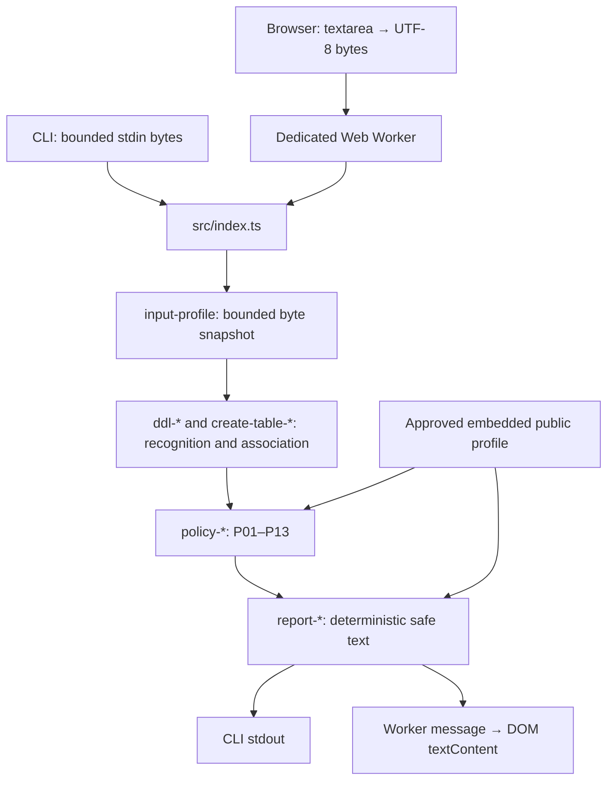

# Architecture

The same synchronous `checkCompatibility(Uint8Array): string` evaluates every input
in the CLI and browser. It performs no I/O. The browser runs it in a dedicated Web
Worker; the CLI imports the compiled entry point. Neither connects to a database.

## Where to start

| Path | Responsibility |
| --- | --- |
| `src/index.ts` | Small public semantic API; internal defects propagate |
| `src/input-profile.ts`, `source-cursor`, `utf8`, `lexical-trivia` | Raw bounds, UTF-8, source spans and lexical primitives |
| `src/create-table-*` | Frozen bounded recognition grammar and declaration conflict selectors |
| `src/ddl-*` | Statement adapters, typed evidence, complete declaration association |
| `src/policy-*` | Approved predicate evaluation and ordered findings |
| `src/report-*` | Governed report bytes and safe dynamic display |
| `src/public-profile.ts` | Embedded public data; verified against approved JSON before build |
| `cli/` | Bounded stdin and process exit/error handling |
| `web/` | Static page, DOM presentation and worker boundary |
| `test/` | Core, conformance, exact reports, recognition parity and real CLI processes |
| `e2e/` | Browser flows, failure handling, XSS and privacy tests |
| `scripts/` | Build and verification, not application runtime |
| `spec/`, `docs/` | Reviewed profile, behavior, recognition and contributor documentation |

The flat core uses descriptive family prefixes. Keeping these paths stable preserves
reviewed grammar and test traceability. Parser evidence types refer to each other;
the compiled runtime dependency graph is acyclic. Adapters depend on the core, never
the reverse. Recognition does not depend on policy. There is no general utility layer,
dynamic plugin system, runtime profile fetch or second browser policy implementation.

## Build and dependencies

TypeScript compiles the CLI's semantic core. esbuild bundles the same source into an
isolated browser worker and a small separate DOM application. Native HTML/CSS controls
need no frontend framework, editor package, UI kit or runtime npm dependency.
Playwright is development-only browser automation. All direct dependencies are pinned
and the npm lockfile records transitive integrity. Installs use `--ignore-scripts`.

The web output contains only HTML, hashed JavaScript and CSS. There are no functions,
server rendering, source maps or environment-variable substitutions. No private
repository is needed to install, build or verify the public source distribution.

See [security and privacy](SECURITY.md), [evaluator traceability](EVALUATOR.md), and
[the exact report/process contract](CHECK_BEHAVIOR_V2.md). Normative documents preserve
their original historical milestone wording; runnable implementation status belongs
to the README and implementation documentation.
